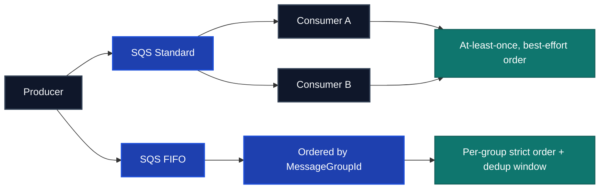
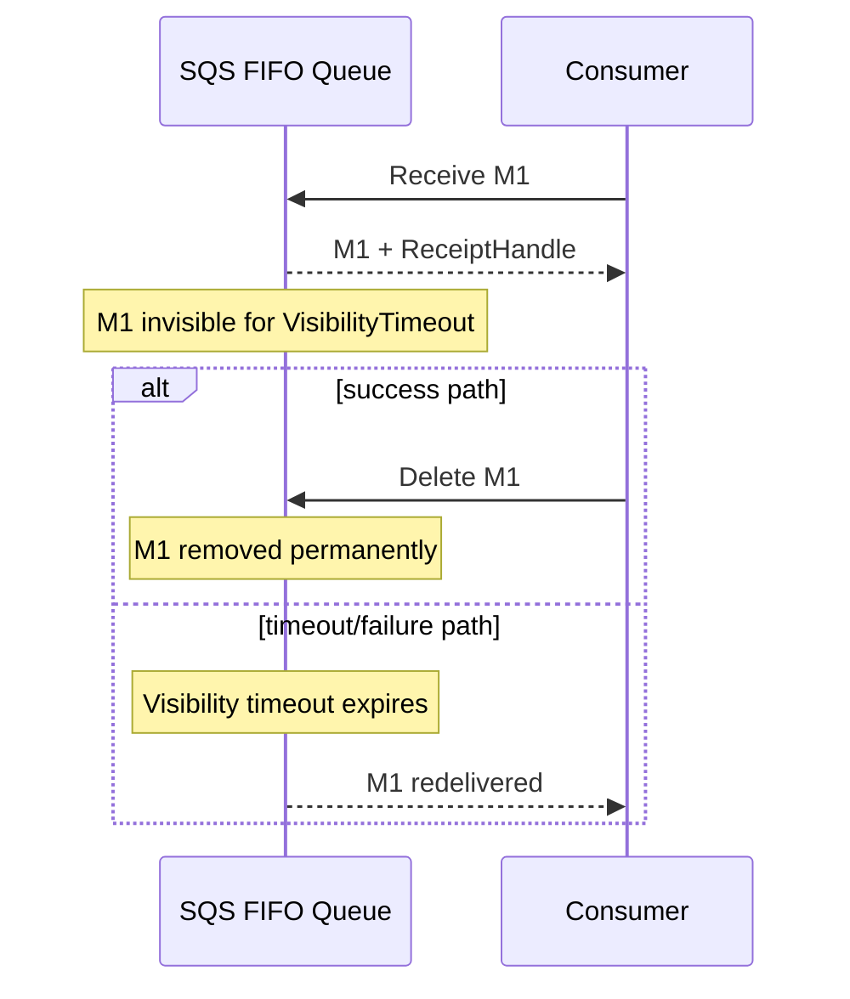
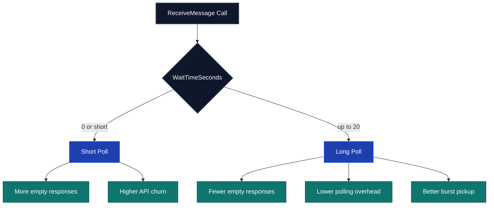
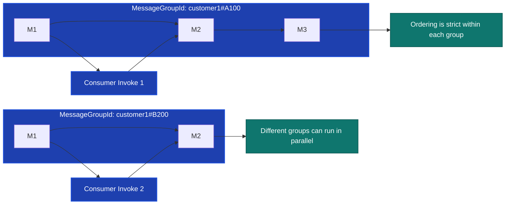
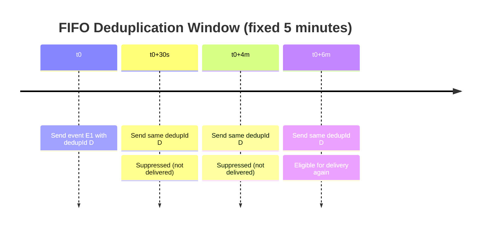
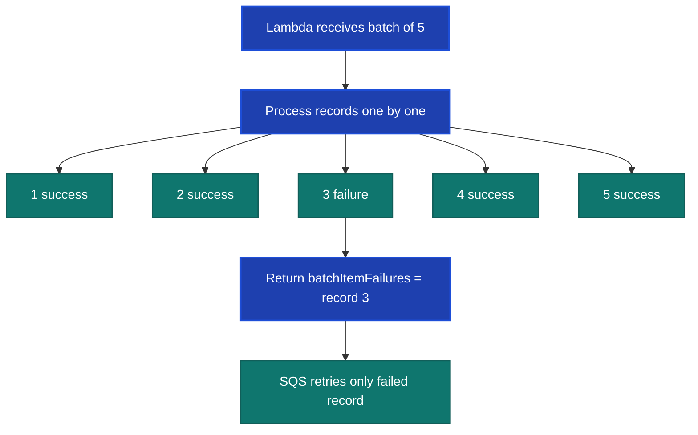
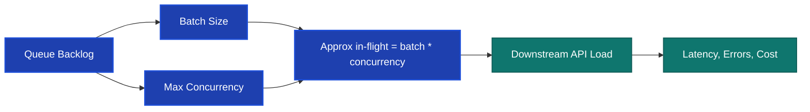

# SQS FIFO Reliability Playbook

Runnable examples and notes for exploring SQS FIFO reliability patterns across Node.js and Java.

This repo pairs with the Medium article **"We Moved to SQS FIFO and Found the Real Failure Modes"** and keeps the code examples, runbooks, and screenshots aligned across both languages.

## Published Article

- Level Up Coding: [We Moved to SQS FIFO and Found the Real Failure Modes](https://levelup.gitconnected.com/we-moved-to-sqs-fifo-and-found-the-real-failure-modes-39cc20bb67f0)

## What’s inside

- `nodejs-examples/` - Node.js scripts for local setup, producer, consumer, visibility heartbeat, end-to-end harness, and purge.
- `java-examples/` - Java 17 examples for the same FIFO scenarios and verification flow.

Each folder has its own README with language-specific commands and output expectations.

## Recommended flow

1. Set up LocalStack and the demo queues from `nodejs-examples/`.
2. Run the Node.js producer and consumer examples to capture the main FIFO ordering and dedup screenshots.
3. Run the visibility heartbeat example to show how long-running work keeps a message in-flight safely.
4. Run the end-to-end harness to verify ordering and duplicate suppression.
5. Run the matching Java examples if you want to compare output format and behavior side by side.

## Quick start

### Local setup

From `nodejs-examples/`:

```bash
npm run local:setup
```

If you want to reset queue state before a new demo run:

```bash
npm run purge
```

### Node.js examples

See [`nodejs-examples/README.md`](nodejs-examples/README.md) for the full list of commands and screenshot guidance.

### Java examples

See [`java-examples/README.md`](java-examples/README.md) for the Java 17 commands and the shared harness entry point.


## Notes

- The examples are designed for LocalStack or AWS SQS.
- The harness and output formatting are kept intentionally consistent between Node.js and Java so the blog can show a single story with two implementations.
- Queue reset and local bootstrap scripts live in the Node.js folder because they are shared across both language examples.

## Key Concepts Visualized


### FIFO vs Standard

This diagram contrasts Standard and FIFO queues so the article can explain why FIFO changes ordering and dedup behavior.
Look at the producer fan-out on the left and the delivery guarantees on the right.
Use it to explain why FIFO is a different reliability contract, not just a different queue type.



### Visibility timeout lifecycle

This diagram shows how a message becomes invisible during processing, then either gets deleted on success or redelivered when the visibility lease expires.
The key point is that visibility is a lease, not a delay.
Use it to explain why long-running work needs heartbeat-style visibility extension.



### Long polling behavior

This diagram shows why a 20-second long poll reduces empty receives and improves burst pickup compared with short polling.
The tradeoff is fewer empty responses versus slightly longer waits for messages.
Use it to explain why long polling lowers noise and improves efficiency in demo runs.



### Message group ordering

This diagram shows that ordering is strict within a single `MessageGroupId`, while different groups can process in parallel.
Notice that one stream is serialized while another can advance independently.
Use it to explain how FIFO preserves business ordering without forcing global serialization.



### Dedup window

This diagram shows the fixed five-minute dedup window where repeated dedup IDs are suppressed before becoming eligible again.
The important detail is that duplicates are only blocked for a time window, not forever.
Use it to explain why a stable entity ID can suppress valid retries or rapid updates.



### Lambda partial batch retry

This diagram shows how Lambda partial batch failure lets SQS retry only the failed record instead of replaying the whole batch.
The point is to avoid reprocessing successful records just because one record failed.
Use it to explain why batch failure handling is a reliability feature, not just an implementation detail.



### Throughput tuning with batch size and concurrency

This diagram shows the tradeoff between backlog, batch size, and concurrency, and how they combine into downstream load.
It helps readers see that throughput tuning is really about in-flight work and downstream pressure.
Use it to explain why batch size and concurrency should be tuned together, not independently.


